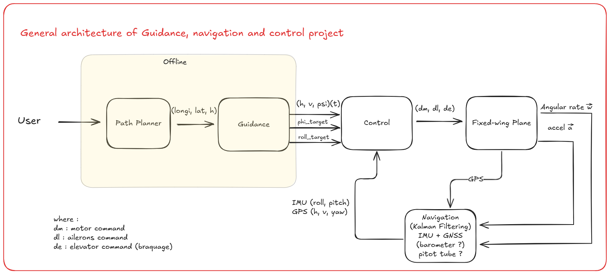

# ESP 32 Flight Controller
___

### PIN DEFINITION:
* Servos:
    * left servo: 13 
    * right servo: 12 
    * pitch servo: 14

* FlySky Reciever:
    * Roll: 2 
    * Pitch: 4
    * Flaps: 5

* GPS:
    * sda: 16
    * scl: 17

* MPU5060: 
    * sda: 21
    * scl: 22

<<<<<<< Updated upstream
# The general architecture used to perform autonomous missions is the following

=======

### Design:

>>>>>>> Stashed changes
